# DevPod Provider ACI - Architecture Documentation

## Overview

The DevPod Provider ACI is a .NET-based provider that enables DevPod to create and manage development environments on Azure Container Instances (ACI). It provides a serverless approach to development containers with automatic scaling, pay-per-use pricing, and seamless integration with Azure services.

## Architecture Components

### Core Architecture

```mermaid
graph TD
    A[DevPod Core] -->|DevPod Provider Interface| B[DevPod Provider ACI]
    
    subgraph "DevPod Provider ACI"
        B --> C[Commands Layer]
        B --> D[Services Layer]
        B --> E[Models Layer]
        B --> F[Infrastructure Layer]
        
        C --> C1[InitCommand]
        C --> C2[CreateCommand]
        C --> C3[DeleteCommand]
        C --> C4[StartCommand]
        C --> C5[StopCommand]
        C --> C6[StatusCommand]
        C --> C7[CommandCommand]
        
        D --> D1[AciService]
        D --> D2[AuthenticationService]
        D --> D3[ProviderOptionsService]
        
        E --> E1[ContainerGroupDefinition]
        E --> E2[ContainerStatus]
        E --> E3[ProviderOptions]
        
        F --> F1[CommandRouter]
        F --> F2[Logger]
        F --> F3[Constants]
    end
    
    B -->|Azure SDK| G[Azure Cloud]
    
    subgraph "Azure Cloud"
        G --> H[Azure Container Instances]
        G --> I[Azure Storage]
        G --> J[Azure Networking]
        G --> K[Azure Resource Groups]
    end
    
    style A fill:#e1f5fe
    style B fill:#f3e5f5
    style G fill:#e8f5e8
    style H fill:#fff3e0
    style I fill:#fff3e0
    style J fill:#fff3e0
    style K fill:#fff3e0
```

## Layer Breakdown

### 1. Commands Layer
**Location**: `src/DevPod.Provider.ACI/Commands/`

The Commands layer implements the DevPod provider interface by handling the core lifecycle operations:

- **InitCommand** (`InitCommand.cs`): Validates provider configuration and Azure connectivity
- **CreateCommand** (`CreateCommand.cs`): Provisions new ACI container groups
- **DeleteCommand** (`DeleteCommand.cs`): Removes container groups and associated resources
- **StartCommand** (`StartCommand.cs`): Starts stopped container instances
- **StopCommand** (`StopCommand.cs`): Stops running container instances
- **StatusCommand** (`StatusCommand.cs`): Reports container group status and health
- **CommandCommand** (`CommandCommand.cs`): Executes commands inside running containers

Each command follows a consistent pattern:
- Dependency injection for services
- Input validation and error handling
- Azure API interaction through services
- Structured JSON output for DevPod

### 2. Services Layer
**Location**: `src/DevPod.Provider.ACI/Services/`

The Services layer abstracts Azure operations and provider configuration:

#### AciService (`AciService.cs`, `IAciService.cs`)
Core service for Azure Container Instances operations:
- Container group lifecycle management (create, start, stop, delete)
- Resource group management (auto-creation)
- Network configuration (public IP, VNET integration)
- Storage volume mounting (Azure File shares)
- Command execution and log retrieval
- Retry policy for transient failures

Key capabilities:
- **Resource Management**: Automatic resource group creation/discovery
- **Container Configuration**: CPU, memory, GPU resource allocation
- **Networking**: Public IP with DNS labels or private VNET integration
- **Storage**: Azure File share volumes for persistent workspaces
- **Monitoring**: Container status tracking and log access

#### AuthenticationService (`AuthenticationService.cs`, `IAuthenticationService.cs`)
Handles Azure authentication and ARM client creation:
- Multiple authentication methods (Azure CLI, Service Principal, Managed Identity)
- ARM client factory with proper credential management
- Authentication validation and error handling

#### ProviderOptionsService (`ProviderOptionsService.cs`, `IProviderOptionsService.cs`)
Manages provider configuration from environment variables:
- Option parsing and validation from `provider.yaml`
- Environment variable resolution
- Default value application
- Configuration serialization for debugging

### 3. Models Layer
**Location**: `src/DevPod.Provider.ACI/Models/`

Data models representing provider entities:

#### ContainerGroupDefinition (`ContainerGroupDefinition.cs`)
Defines the desired state for an ACI container group:
- Resource specifications (CPU, memory, GPU)
- Image and registry configuration
- Environment variables and commands
- Network settings (DNS, VNET)
- Storage volume definitions

#### ContainerStatus (`ContainerStatus.cs`)
Represents the current state of container groups:
- Provisioning and runtime states
- Container instance details
- Network endpoints (FQDN, IP addresses)
- Health and status information

#### ProviderOptions (`ProviderOptions.cs`)
Configuration model matching `provider.yaml`:
- Azure subscription and authentication settings
- Resource allocation preferences
- Network and storage configuration
- DevPod agent settings

### 4. Infrastructure Layer
**Location**: `src/DevPod.Provider.ACI/Infrastructure/`

Supporting infrastructure components:

#### CommandRouter (`CommandRouter.cs`)
Routes DevPod commands to appropriate command handlers:
- Command parsing and validation
- Service provider integration
- Error handling and logging
- Exit code management

#### Logger (`Logger.cs`)
Structured logging configuration:
- Console output formatting
- Debug mode support via `DEVPOD_DEBUG`
- Azure operation tracing

#### Constants (`Constants.cs`)
Centralized constants and configuration:
- Command names and identifiers
- Azure resource naming patterns
- Default values and limits

## Data Flow

### Container Creation Flow
1. **DevPod** calls create command with workspace configuration
2. **CreateCommand** validates input and retrieves provider options
3. **ProviderOptionsService** parses environment variables and applies defaults
4. **AuthenticationService** establishes Azure ARM client connection
5. **AciService** provisions resource group and container group
6. **Azure ACI** creates container instance with specified configuration
7. **Response** returns container status and connection details to DevPod

### Container Management Flow
1. **DevPod** issues lifecycle commands (start/stop/delete/status)
2. **CommandRouter** routes to appropriate command handler
3. **Command** retrieves container group information via AciService
4. **AciService** performs Azure API operations with retry policies
5. **Response** returns updated status or operation results

## Security Architecture

### Authentication & Authorization
- **Azure Identity**: Multiple authentication flows (CLI, SP, Managed Identity)
- **Credential Management**: Secure handling of service principal secrets
- **RBAC Integration**: Uses Azure RBAC for resource access control
- **Key Vault Integration**: Support for ACR credentials and storage keys

### Network Security
- **Public Access**: Optional DNS labels for direct container access
- **Private Networks**: VNET integration for isolated container groups
- **Container Security**: DevPod agent injection with secure communication

### Storage Security
- **Azure File Shares**: Encrypted persistent storage for workspaces
- **Access Keys**: Secure storage account key management
- **Mount Security**: Proper volume mount permissions

## Scalability & Performance

### Resource Management
- **Serverless Scaling**: ACI provides automatic scaling without VM management
- **Resource Limits**: Configurable CPU, memory, and GPU allocation
- **Cost Optimization**: Pay-per-second billing with automatic shutdown

### Reliability Features
- **Retry Policies**: Exponential backoff for transient Azure API failures
- **Health Monitoring**: Container status tracking and reporting
- **Error Recovery**: Graceful handling of Azure service disruptions

## Configuration Management

### Provider Configuration (`provider.yaml`)
Defines the provider interface for DevPod:
- **Options**: All configurable parameters with defaults and validation
- **Option Groups**: Logical grouping for UI organization
- **Agent Settings**: DevPod agent configuration and injection
- **Binary Distribution**: Multi-platform binary definitions

### Environment-Based Configuration
- **Azure Settings**: Subscription, resource group, region configuration
- **Container Settings**: Resource allocation and restart policies
- **Network Settings**: DNS labels, VNET integration
- **Storage Settings**: File share configuration for persistence

## Extension Points

### Custom Container Images
- Support for private registries (ACR integration)
- Custom base images with development tooling
- Multi-stage builds for optimized container sizes

### Azure Service Integration
- **Storage**: Azure File shares, Blob storage mounting
- **Networking**: VNET peering, private endpoints
- **Monitoring**: Application Insights integration
- **Security**: Key Vault secret injection

### DevPod Integration
- **Agent Injection**: Automatic DevPod agent installation
- **Credential Injection**: Git and Docker credential forwarding
- **Port Forwarding**: Automatic port exposure for development

## Deployment Architecture

### Binary Distribution
Multi-platform binaries distributed via GitHub releases:
- Linux (amd64, arm64)
- macOS (amd64, arm64)
- Windows (amd64)

### Runtime Requirements
- **.NET 8.0 Runtime**: Cross-platform execution
- **Azure CLI** (optional): For CLI-based authentication
- **DevPod Core**: Provider interface compatibility

## Future Architecture Considerations

### Planned Enhancements
- **Multi-Container Support**: Container group with multiple containers
- **GPU Optimization**: Enhanced GPU support for ML/AI workloads
- **Spot Instances**: Cost optimization with Azure spot pricing
- **Autoscaling**: Container group scaling based on usage

### Integration Opportunities
- **Azure DevOps**: Pipeline integration for CI/CD workflows
- **GitHub Codespaces**: Alternative deployment target
- **Terraform Provider**: Infrastructure as Code integration
- **Azure Arc**: Hybrid cloud container management