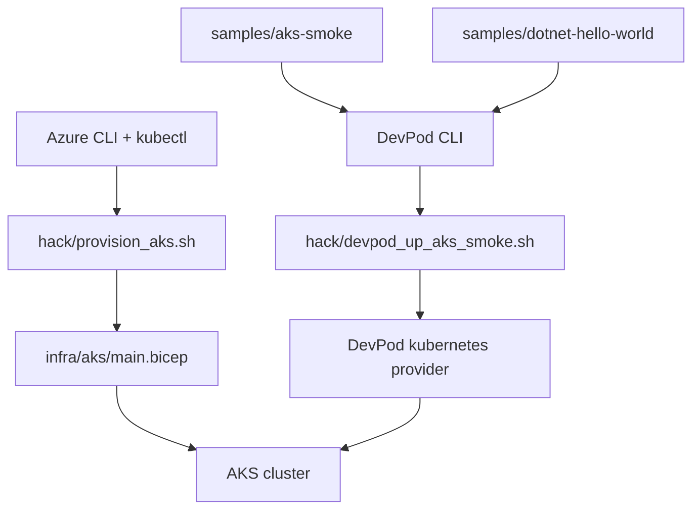

# DevPod on AKS Architecture

## Overview

This repository is intentionally thin. It does not ship a custom DevPod
provider. Instead, it combines:

- AKS infrastructure in Bicep
- a small provisioning helper
- a smoke-test helper for DevPod's built-in `kubernetes` provider
- minimal sample workspaces

The supported control path is:

```mermaid
graph TD
    A["Azure CLI + kubectl"] --> B["hack/provision_aks.sh"]
    B --> C["infra/aks/main.bicep"]
    C --> D["AKS cluster"]
    E["DevPod CLI"] --> F["hack/devpod_up_aks_smoke.sh"]
    F --> G["DevPod kubernetes provider"]
    G --> D
    H["samples/aks-smoke"] --> E
    I["samples/dotnet-hello-world"] --> E
```

## Repository Components

### `infra/aks/`

Source of truth for the AKS cluster definition.

- `main.bicep`: authoring source
- `main.json`: rendered ARM JSON snapshot

Current defaults favor a practical smoke environment:

- one system node pool
- Azure CNI Overlay
- RBAC enabled
- OIDC issuer and workload identity enabled
- CSI storage drivers enabled

### `hack/provision_aks.sh`

Creates or updates the AKS environment from the Bicep template.

Responsibilities:

- validates required environment variables
- resolves the SSH public key
- creates the resource group if needed
- deploys the AKS template with explicit parameters

### `hack/devpod_up_aks_smoke.sh`

Bridges DevPod into the AKS cluster by using the first-party `kubernetes`
provider.

Responsibilities:

- fetches kubeconfig for the cluster
- installs or reuses a named DevPod provider entry
- applies provider options such as namespace, context, and storage class
- runs `devpod up` against `samples/aks-smoke`

### `samples/`

Two workspace shapes are kept on purpose:

- `samples/aks-smoke/`: minimal local-path workspace for first validation
- `samples/dotnet-hello-world/`: richer sample app for follow-up testing

## Design Rules

1. Keep AKS bootstrap logic centralized in `infra/aks/` and `hack/`.
2. Keep workspace validation separate from cluster provisioning.
3. Prefer samples and docs over custom orchestration code.
4. Preserve historical ACI context only as archived reference material.

## Supported Flow

1. Provision AKS with `./hack/provision_aks.sh`.
2. Fetch credentials and configure DevPod through `./hack/devpod_up_aks_smoke.sh`.
3. Validate `samples/aks-smoke`.
4. Move to a richer workspace such as `samples/dotnet-hello-world`.

## What Is Intentionally Missing

- no custom provider binary
- no provider manifest packaging flow
- no repo-owned container lifecycle controller
- no direct ACI transport logic
