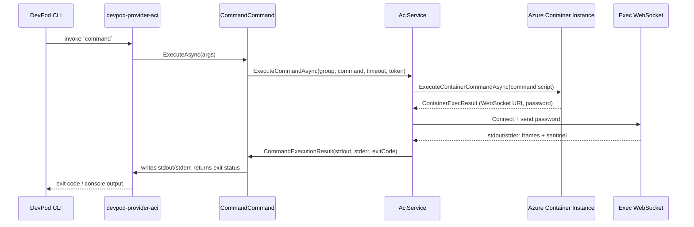
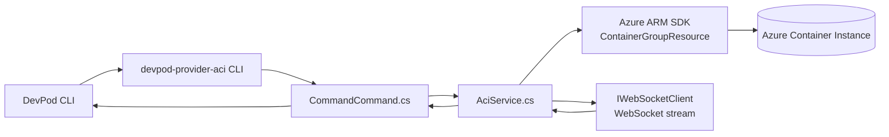

# Command Execution Flow

## End-to-End Walkthrough

1. **Create** – From VS Code, DevPod CLI asks the provider to create an environment. CreateCommand provisions an ACI container group, mounts storage, opens port 22, and boots the workspace image thanks to the Azure ARM SDK.
2. **Status lifecycle** – status, start, and stop commands keep DevPod informed about the container’s health so the VS Code extension knows when the environment is ready.
3. **Agent injection** – Once the container is running, DevPod triggers the command handler with a devpod agent payload. The new exec pipeline asks Azure for an exec session, upgrades to the WebSocket URI, and streams stdout/stderr while watching the sentinel exit code. That lets DevPod push its agent into the container without any SSH tunnel yet.
4. **Editor connection** – After the agent is installed, DevPod coordinates the VS Code tunnel using the exposed SSH port or agent channel. Because command exec is functional, the agent can start the VS Code server (or other tooling) inside the container, which your local VS Code front-end connects to for remote editing/debugging.

From the user perspective: run DevPod in VS Code, pick this provider, and it creates the ACI container, injects the DevPod agent through the WebSocket-backed exec, then VS Code attaches to the agent-managed tunnel for a seamless remote development session.

## Sequence Overview

## Component Relationships

