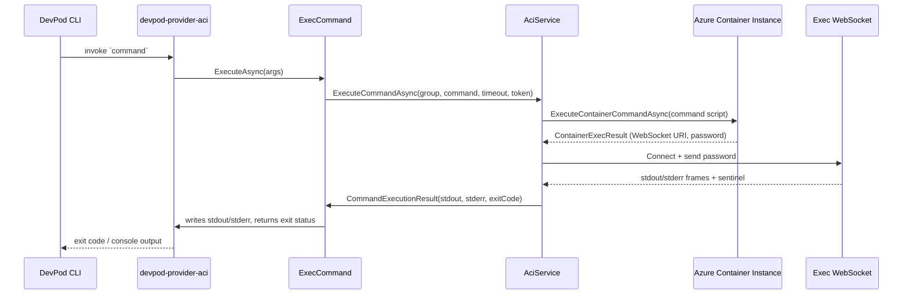
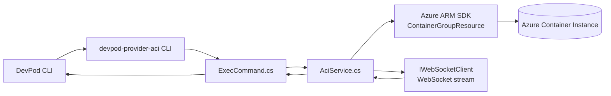

# Command Execution Flow

## End-to-End Walkthrough

1. **Create** – DevPod CLI invokes `create` with a published workspace image. CreateCommand validates that the request is image-backed, rejects unsupported local-path/git/private-network flows, and provisions an ACI container group from that image.
2. **Status lifecycle** – status, start, and stop commands keep DevPod informed about the container’s health so the VS Code extension knows when the environment is ready.
3. **Agent injection** – Once the container is running, DevPod triggers the command handler with a devpod agent payload. The new exec pipeline asks Azure for an exec session, upgrades to the WebSocket URI, and streams stdout/stderr while watching the sentinel exit code. That lets DevPod push its agent into the container without any SSH tunnel yet.
4. **Editor connection** – After the agent is installed, DevPod connects to the running ACI-backed workspace through the injected agent path. In the current release, the provider is intended for published image workspaces rather than general `.devcontainer` feature execution.

From the user perspective: run `devpod up <published-image> --provider <aci-provider>`, let the provider create the ACI container group, then let DevPod inject and use the agent through the ACI exec WebSocket.

## Sequence Overview

## Component Relationships

